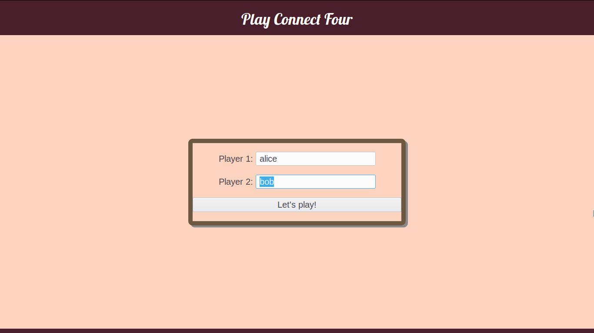
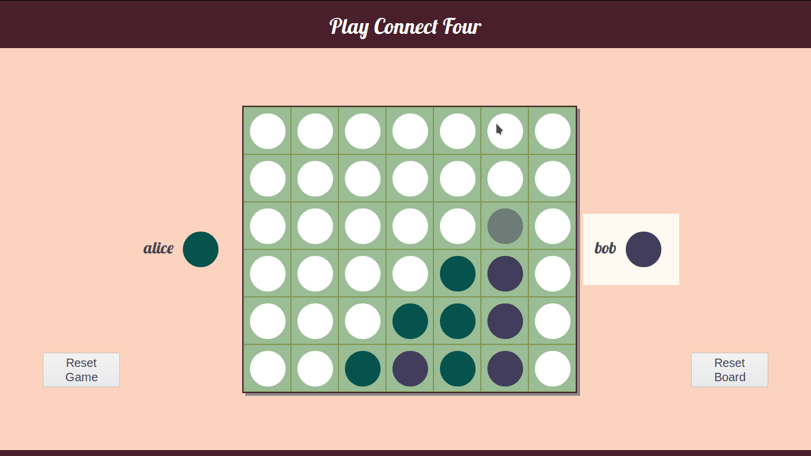
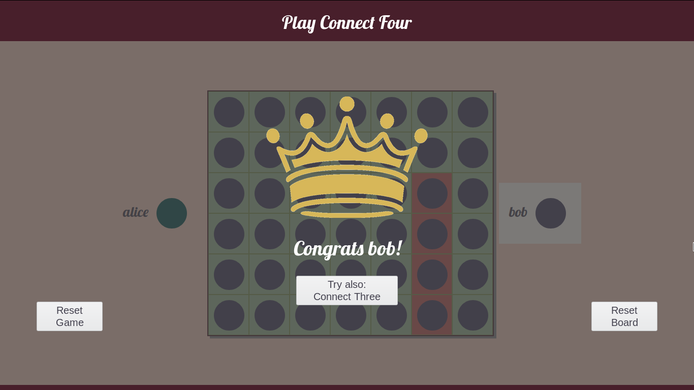

# Connect Four

Simple implementation of the well-known board game. For rules please refer to [Wikipedia](https://en.wikipedia.org/wiki/Connect_Four).

Find the live version running under [https://batabana.github.io/connect-four/](https://batabana.github.io/connect-four/).

## Features

- Players can choose their names.
- It is indicated which player's turn it is next.
- The current player gets a preview of her or his next move when hovering over the board.
- When a vertical, horizontal or diagonal win happens, the board indicates the winning tokens and then fills up in the winning color.
- After one round of Connect Four one can also choose to play Connect Three.
- It is always possible to reset either just the current game or the whole board incl. players.

## Technologies

- HTML, CSS, JavaScript (jQuery)

## Preview

### choose names

### play the game

### win and if desired play again

